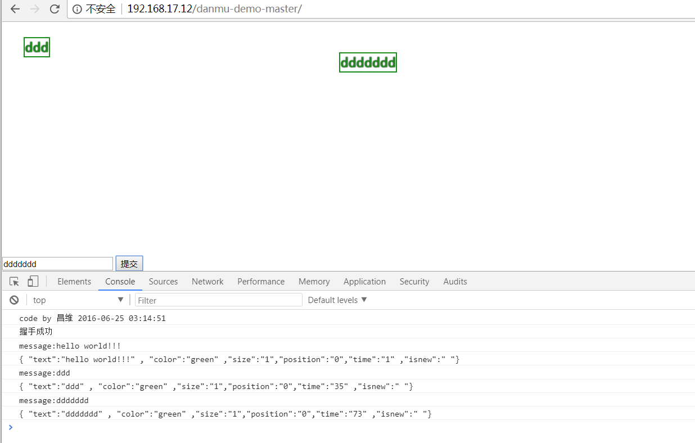
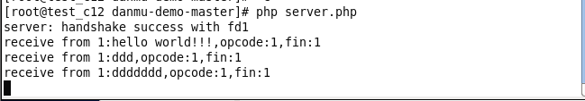

参考https://github.com/cw1997/danmu-demo

我运行后出现了一些错误,就换掉了serverl.php的代码

用了swoole手册中swoole WebSocket实例的代码

https://www.w3cschool.cn/swoole/swoole-websocket.html这里的一段代码

# 前端HTML5 websocket结合后端swoole实现的弹幕系统
服务端使用php的swoole扩展，不到二十行代码。前端使用jquery.danmu插件。

安装swoole扩展参考cuihuanhuan.github.io

